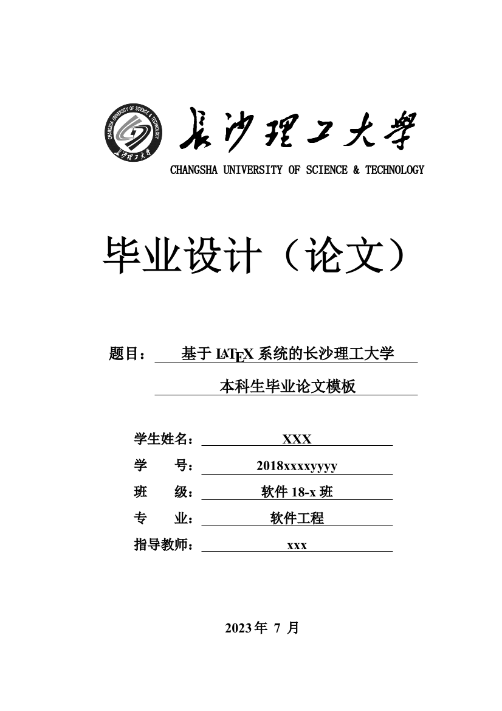

# A CSUST Bachelor Thesis Template

本项目参考长沙理工大学官方提供的毕业论文 Word 模板设计了一份 LaTeX 模板，包括以下四份模板：
- 论文（[thesis.tex](thesis.tex)）
- 开题报告（[research_proposal.tex](research_proposal.tex)）
- 任务书（[task_book.tex](task_book.tex)）
- 外文译文及原文（[translation.tex](translation.tex)）

此外本组织还维护了一个相关的 Beamer 模板项目：[csust-latex-sig/CSUSTGraduationSlides](https://github.com/csust-latex-sig/CSUSTGraduationSlides)，
可用于制作毕业答辩使用的幻灯片。

本项目为今后想使用 LaTeX 撰写毕业论文的学弟学妹们提供了一份参考，但模板本身还存在许多不足之处，
长理的论文撰写规范以后也可能会发生变化，因此本项目需要一届又一届长理学子接力维护和发展。

希望长理的 LaTeX 交流氛围越来越好，也欢迎加入[我们](https://github.com/csust-latex-sig)！

## 展示

模板效果可以到 [Releases](https://github.com/csust-latex-sig/CSUSTBachelorThesis/releases)
页面下载对应的 PDF 文件查看。



## 使用

详细使用方法请阅读[模板使用指南](https://github.com/csust-latex-sig/CSUSTBachelorThesis/releases/latest/download/thesis.pdf)，
这里只简单介绍命令行编译方法，指南中有图形化界面工具配置的介绍。

由于模板中存在参考文献引用和各种交叉引用，一次 `xelatex` 编译不会生成正确的目录和参考文献，
所以需要依次使用 `xelatex`、`biber`、`xelatex`、`xelatex` 四次编译，例如：

```bash
# 编译论文的命令（编译命令可省略 .tex 后缀）
xelatex thesis
biber thesis
xelatex thesis
xelatex thesis
```

我们还编写了一个 [Makefile](Makefile) 来简化命令行编译的过程，如果你安装了 Make，也可以试试
下面的编译方式：

- 编译论文：
  ```bash
  make thesis
  ```
- 编译开题报告：
  ```
  make research_proposal
  ```
- 编译任务书：
  ```bash
  make task_book
  ```
- 编译外文译文及原文：
  ```bash
  make translation
  ```
- 一次全部编译：
  ```bash
  make all
  ```
- 删除所有生成的文件（注意！也会删除生成的 PDF）：
  ```bash
  make clean
  ```

## 交流

欢迎加入**长沙理工大学 LaTeX 交流群**。QQ 群号：**169929184** 。


